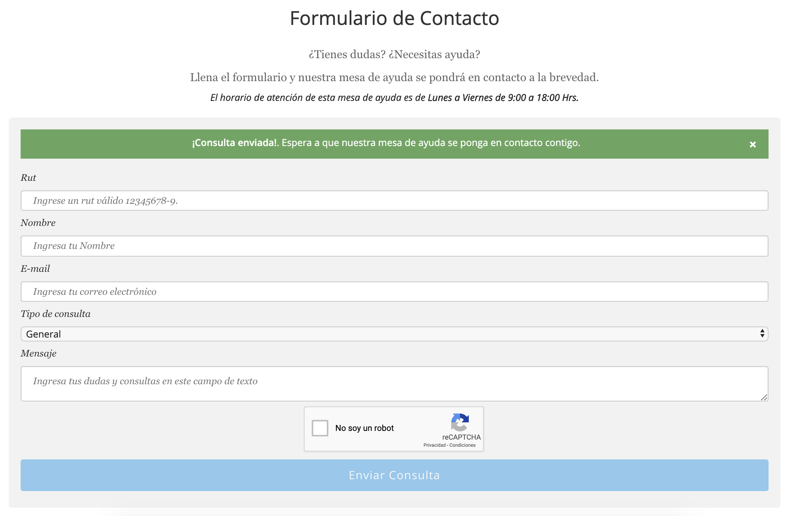

# EOL CONTACT FORM


New Page for Open Edx LMS (EOL) with a contact form

# Install

    docker-compose exec lms pip install -e /openedx/requirements/eol_contact_form

# Configuration

To enable [Google ReCAPTCHA v2](https://www.google.com/recaptcha/) Edit *production.py* in *lms settings* and add your own keys. Add help desk default email.

    EOL_CONTACT_FORM_RECAPTCHA_SITE_KEY = AUTH_TOKENS.get('EOL_CONTACT_FORM_RECAPTCHA_SITE_KEY', '')
    EOL_CONTACT_FORM_RECAPTCHA_SECRET_KEY = AUTH_TOKENS.get('EOL_CONTACT_FORM_RECAPTCHA_SECRET_KEY', '')
    EOL_CONTACT_FORM_HELP_DESK_EMAIL = AUTH_TOKENS.get('EOL_CONTACT_FORM_HELP_DESK_EMAIL', '')

Set help desk email in a Site:
- */admin/site_configuration/siteconfiguration/*
    - **"EOL_CONTACT_FORM_HELP_DESK_EMAIL":""**

# Translations:
To add new words to be translated you need to follow these steps.
1. Create the container where the commands will be run:
    ```
    docker run -it --rm -w /code -v $(pwd):/code python:3.8 bash
    ```

2. Install the requirements:
    ```
    pip install -r requirements.in
    ```

3. Update the translations:

    ```
    make update_translations
    ```

4. Modify .po:
> [!WARNING]
> REMEMBER: Remember to add the Spanish translation.

5. Compile the modified .po into .mo
    ```
    make compile_translations
    ```
# TESTS
**Prepare tests:**

    > cd .github/
    > docker-compose run lms /openedx/requirements/eol_contact_form/.github/test.sh

# Screenshots
*Last Update 15/04/2020*

<p align="center">

</p>
